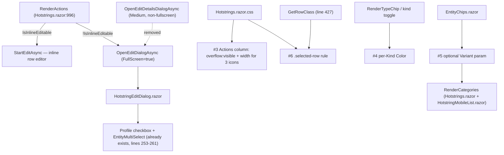

# Hotstrings page UX fixes

## Context

User testing of the Hotstrings page surfaced a real UX regression plus several rough
edges (7 screenshots + written notes). Core bug: rows expose two edit affordances — a
pencil ("start inline edit") and an `EditNote` icon (opens a popup) — but the pencil only
appears for plain Text-kind hotstrings with no window context
(`HotstringEditModel.IsInlineEditable`, `Validation/HotstringEditModel.cs:58`). Every other
kind must use the popup, and that popup (`OpenEditDetailsDialogAsync`,
`Pages/Hotstrings.razor:774`, `MaxWidth.Medium`, non-fullscreen) renders the profile
selector in a cramped layout, unlike the inline editor which shows it immediately. Goal:
one edit button per row, behavior branches by type (inline for Text, fullscreen dialog for
everything else), full parity in the dialog including profile changes.

Verified directly in code (not assumed):
- `HotstringEditDialog.razor:253-261` already renders the profile checkbox + `EntityMultiSelect`
  — the "can't change profile" complaint is the Medium-width dialog's layout, not a data gap.
  `HotstringEditModel.Clone/ToCreateDto/ToUpdateDto` (lines 156-196) already round-trip
  `ProfileIds`/`AppliesToAllProfiles` correctly.
- `OpenEditDialogAsync` (`Pages/Hotstrings.razor:771`, `FullScreen = true`) is the same method
  already used by mobile's `OnEdit` (line 234) and `PromoteInlineRowAsync` (line 738) — it's
  the established fullscreen path, not something new to build.
- `RenderActions` (`Pages/Hotstrings.razor:996-1021`) is where both buttons currently render.
- `Hotstrings.razor.css:39-43` applies `overflow:hidden; text-overflow:ellipsis` to every
  `.mud-table-cell` including Actions (`:nth-child(8)`, fixed `132px`, lines 92-95) — at higher
  zoom the 4 icon buttons (edit-details, start-edit, history, delete) don't fit and the browser
  renders a real ellipsis over the last icon. This is a CSS bug, not a missing menu.
- `RenderTypeChip` (line 943-949): only Raw gets a distinct color (`Warning`); Text/DateTime/Macro
  render `Color.Default`. Same gap in `HotstringEditDialog.razor`'s kind toggle (lines 22-34,
  only Raw gets an icon/color).
- `EntityChips.razor` (`Components/Common/EntityChips.razor`) renders plain `<MudChip>` with no
  `Variant` parameter — used in 4 places: `Hotstrings.razor` (profiles + categories, desktop),
  `Hotkeys.razor` (profiles + categories), `HotstringMobileList.razor`, `HotkeyMobileList.razor`.
  No existing `Variant` param to reuse; adding one is additive (default `Filled`, no existing
  caller changes behavior).
- No existing CSS targets MudDataGrid's selected-row state anywhere in the app — this needs
  browser inspection at implementation time (the row's `RowClassFunc` mechanism already exists
  and is the better lever here, see #6 below, rather than guessing MudBlazor's internal class).
- `GetRowClass` (line 427-428) already conditionally adds `edit-row`/`draft-row` per row (though
  no CSS currently defines those classes — likely test-selector hooks only). This is the existing
  pattern to extend for selection highlighting.

## Approach



### 1. Single edit button per row

In `RenderActions` (`Pages/Hotstrings.razor:996-1021`), replace the two non-editing buttons
(`edit-details` + conditional `start-edit`) with one:

```csharp
<MudIconButton Class="edit" Icon="@Icons.Material.Filled.Edit"
               OnClick="() => (item.IsInlineEditable ? StartEditAsync(item) : OpenEditDialogAsync(item))" />
```

Keep `show-history` and `delete` unchanged. Leave the in-progress inline-edit toolbar
(`commit-edit`/`cancel-edit`/`promote-edit`) untouched — `promote-edit` escalates an
in-flight inline edit, it's not a second entry point into editing.

### 2. Standardize the popup on the fullscreen dialog

Delete `OpenEditDetailsDialogAsync` (`Pages/Hotstrings.razor:774-775`) entirely — the single
edit button routes non-inline-editable rows through the existing `OpenEditDialogAsync`
(line 771, already `FullScreen = true`). No new dialog plumbing needed.

### 3. Actions column CSS: stop the fake "..." clipping

In `Hotstrings.razor.css`:
- Add an override so the Actions column (`:nth-child(8)`, line 92-95) is excluded from the
  ellipsis rule at lines 39-43: add `::deep .hotstrings-grid td:nth-child(8) { overflow: visible; }`.
- Resize the fixed width at line 92-95 down from `132px` for exactly 3 icons (Edit, History,
  Delete) now that #1 removed the 4th button.
- Verify visually at 150%/200% browser zoom via Playwright (see Verification).

### 4. Type-badge color coding

Give each `HotstringKind` a distinct, stable `Color`, applied consistently in both:
- `RenderTypeChip` (`Pages/Hotstrings.razor:943-949`) — the non-Text branch's ternary
  (`item.Kind == HotstringKind.Raw ? Color.Warning : Color.Default`) becomes a switch over
  `item.Kind`.
- `HotstringEditDialog.razor`'s `MudToggleGroup` (lines 22-34) — add matching icon/color per
  `MudToggleItem`.

Proposed mapping: `Text = Default`, `DateTime = Info`, `Macro = Success`, `Raw = Warning`
(avoids `Primary`/`Secondary`/`Tertiary`, already used for the page's action buttons, so chip
color and button color stay distinct semantic channels). Text's existing delivery-based color
(Info when clipboard) is orthogonal — leave it as-is in `RenderTypeChip`'s Text branch.

### 5. Differentiate Categories chips from Type/Profile chips

Add an optional `Variant` parameter to `Components/Common/EntityChips.razor`
(default `Variant.Filled` — every existing call site keeps current appearance unless it opts
in). Pass `Variant.Outlined` from the two Hotstrings-page category call sites only:
- `Pages/Hotstrings.razor:928` (`RenderCategories`, desktop grid)
- `Components/Hotstrings/HotstringMobileList.razor:108` (mobile detail list)

Scope decision: don't touch `Hotkeys.razor`'s or `HotkeyMobileList.razor`'s category chips —
the bug report is specific to the Hotstrings page; Hotkeys can adopt the same variant later if
wanted, but that's a separate call site and out of scope here.

### 6. Selected-row highlighting

Extend the existing `GetRowClass` (`Pages/Hotstrings.razor:427-428`) — already the mechanism
that conditionally adds `edit-row`/`draft-row` — to also add `selected-row` when the item is in
`_selected`:

```csharp
private string GetRowClass(HotstringEditModel item, int _)
{
    List<string> classes = [];
    if (IsEditing(item))
        classes.Add(ReferenceEquals(item, _pendingCreate) ? "draft-row" : "edit-row");
    if (_selected.Contains(item))
        classes.Add("selected-row");
    return string.Join(" ", classes);
}
```

This sidesteps guessing MudBlazor's internal selected-row class — it's a class we control and
attach ourselves via a mechanism the page already uses. Add CSS in `Hotstrings.razor.css`:

```css
::deep .hotstrings-grid .selected-row {
    background-color: color-mix(in srgb, var(--mud-palette-primary) 12%, transparent);
}
```

Uses the MudBlazor CSS variable so it tracks the active theme automatically (no separate
light/dark media query needed). Verify visually in both themes via Playwright.

### 7. Type column glyph legend

Add a `HelpOutline` `MudIcon` next to the "Type" column header (`Pages/Hotstrings.razor:153`),
wrapped in a `MudTooltip` with static text: `* = expands immediately`, `? = triggers inside
words`, `C = case sensitive`. Leave the existing per-row `OptionsTooltip` (row-specific hover)
untouched — the header icon is a persistent legend, the per-row tooltip stays the per-row detail.

### Test blast radius

Removing the `edit-details` class/method and renaming `start-edit` → the single `edit` class
breaks selectors in:
- `tests/AHKFlowApp.UI.Blazor.Tests/Pages/HotstringsPageTests.cs` — concretely:
  - `Page_EditDetails_OpensDialogWithItem` (line 656): `button.edit-details` → `button.edit`
  - `Page_DateTimeRow_HidesStartEditPencil_TextRowKeepsIt` (line 751): this test's premise
    (pencil only shows for Text rows) no longer holds — every row has one `button.edit` now.
    Rewrite it to assert both rows render exactly one `button.edit` each, and that clicking it
    on the Text row opens the inline editor (`trigger-input` in the grid) while on the DateTime
    row it opens the dialog (`trigger-input` inside `MudDialogProvider`).
  - All other `button.start-edit` selectors in this file (lines 224-538, ~10 occurrences):
    rename to `button.edit`.
- `tests/AHKFlowApp.E2E.Tests/HotstringsCrudFlowTests.cs:36`, `RawHotstringFlowTests.cs:197`,
  `VersionHistoryFlowTests.cs:141,153` — same `button.start-edit`/`button.promote-edit` renames
  (`promote-edit` is untouched by this plan, only `start-edit` → `edit`).

## Verification

- `dotnet build` + `dotnet test tests/AHKFlowApp.UI.Blazor.Tests` + `dotnet test
  tests/AHKFlowApp.E2E.Tests` after updating the selectors above.
- Playwright (`playwright-cli` skill) against the local no-auth dev stack
  (`Docker SQL (No Auth)` API profile + `http (No Auth)` frontend profile):
  1. Text-kind row, no context: click the single Edit icon → inline row editor opens in place
     (trigger/replacement become editable table cells, not a dialog).
  2. Raw row, Date & time row, Macro row, and a context-matched Text row: click Edit → fullscreen
     dialog opens, profile checkbox + selector visible without scrolling; toggle "Apply to all
     profiles" off, pick a profile, Save; confirm it persists (grid reflects the new profile chips).
  3. Zoom to 150% and 200%: Actions column shows exactly 3 icons (Edit/History/Delete), no
     truncated "...".
  4. Type column: Text/DateTime/Macro/Raw each show a visually distinct chip color; hovering the
     header help icon shows the glyph legend text.
  5. Categories chips render outlined, visibly different from Type/Profile chips, in both the
     desktop grid and mobile detail list.
  6. Select several rows via the checkbox column: rows get the primary-tinted highlight; toggle
     the app's theme switch and confirm it's visible in both light and dark.

## Unresolved questions

1. Macro color = Success (green) ok, or prefer different hue?
2. Legend icon: hover tooltip only, or click-to-open popover (more discoverable, more code)?
3. Selected-row highlight: also wanted on hover, or selection-only?

## Implementation notes

Implemented as committed. Deviations from a live-browser Playwright verification pass: this
session's sandbox had no Docker daemon (no SQL Server backend to run the app against), so
step 3 of "Verification" above was substituted with 5 additional bUnit tests in
`HotstringsPageTests.cs` asserting the same behaviors from rendered markup (chip color
classes, the outlined category chip class, the header legend icon, and the `selected-row`
class after a checkbox selection) — all passing, alongside the full 466-test bUnit suite.
